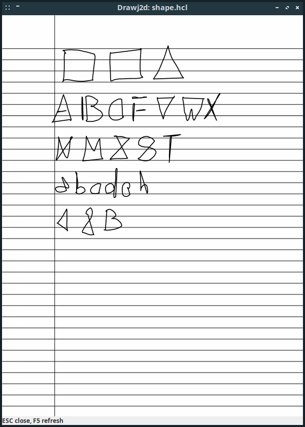
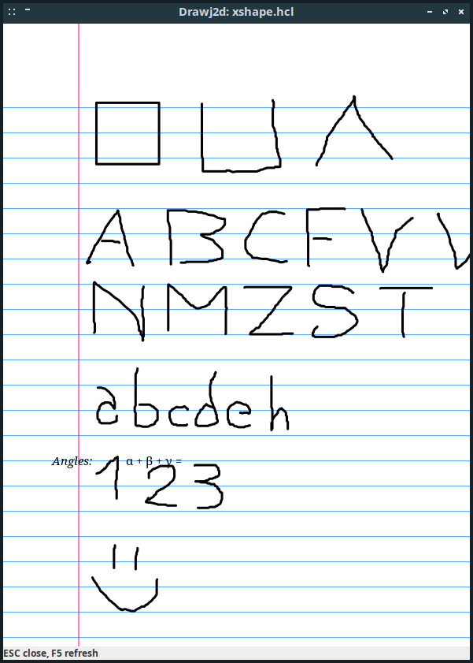

# Files to explain Conversion bug

- Shapes.zip  rM Notebook with shapes
- Shapes.pdf  Same Notebook sent by email
- XShapes.pdf pdf file generated using xournalpp
- shape.hcl   hcl file using Shapes.pdf
- xshape.hcl  hcl file using XShapes.pdf

# Commands

    drawj2d -Tscr -W157 -H209 shape.hcl

    drawj2d -Tscr -W157 -H209 xshape.hcl

# Screenshots

