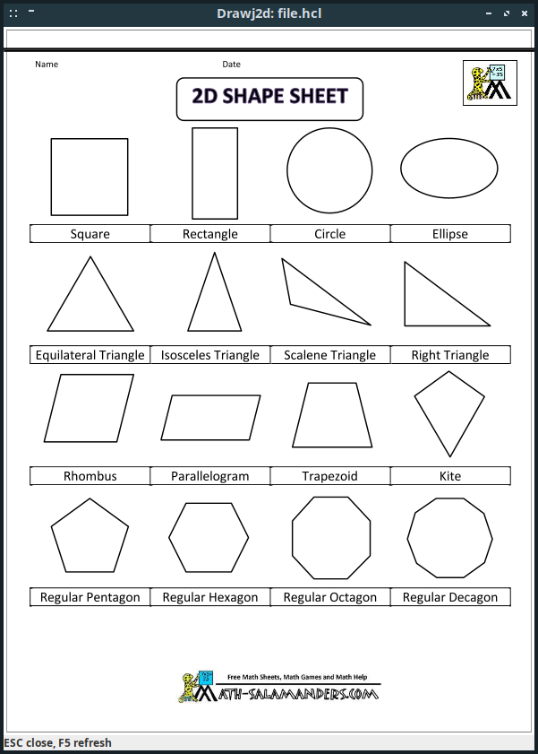

# pdf2rmnotebook

Creates a reMarkable Notebook from multiple PDF files.

## Sample 
In the example folder.
PDF are not correctly ingested.

## Screenshot


## Installation
Create a /var/lib/pdf2rmnotebook folder and copy there the UUID* files from var/lib 

## Usage
Run the stript followed by the list of PDF files, it will create a Notebook.zip file that can be uploaded to rM Cloud via rmapi tool.

```shell
$ pdf2rmnotebook 2d-3.pdf 3d-1.pdf shapes-1.pdf
```

## Thanks
- [drawj2d](https://sourceforge.net/projects/drawj2d/)
