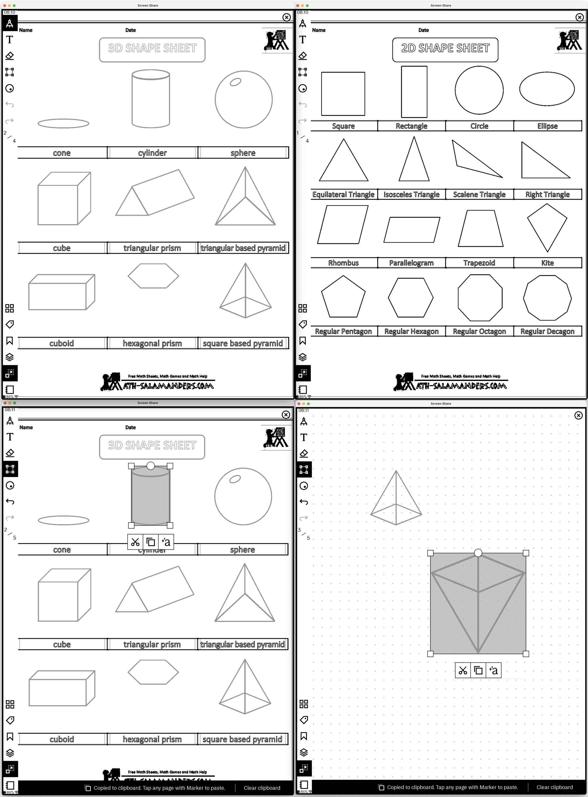

# pdf2rmnotebook

[](https://remarkable.com/store/remarkable)
[](https://remarkable.com/store/remarkable-2)
[](https://remarkable.com/store/remarkable-paper/pro)
[](https://discord.gg/ATqQGfu)

Creates a reMarkable Notebook from multiple PDF or PNG files compatible with RCU and rmapi.

## Changelog

Version
- V1.1   - All pdf pages are converted, no need to split file ( needs pdfinfo command )
- V1.2.0 - Some options added: Verbosity, Usage, Version; Cleanup and Checks
- V2.1.0 - Image formats png/jpg can be directly converted
    - -s option to scale notebook page size to ~A4
- V2.2.0 - Convert to `rmn` files compatible with RCU
    - -r option to create `rmn` files
- V2.2.1 - Fix duplicate pages. The .json file is not needed (anymore?) to give a name to the layer. Name is embedded in .rm file for each page.
- V3.0.0 - DEV branch - Adding options for rM Pro, default to .rmdoc format, convert more filetypes
- V3.1.0 - Convert text files using rmc
- V3.2.0 - Merge aestethic, RMC and Color features ...
- V3.3.0 - Optimize Size for rM Pro Move


## Example

Combine multiple PDFs into a single, editable reMarkable (`.rmn`) document

`$ ./pdf2rmnotebook.sh -r ./example/2d-3.pdf ./example/3d-1.pdf`

The two PDFs are now combined and can be edited on the remarkable using all the standard tools:


## Requirements

- [drawj2d](https://sourceforge.net/projects/drawj2d/)
- pdfinfo: from your distribution package manager:
  - Debian: poppler-utils
  - Homebrew: poppler
- [rmc](https://github.com/ricklupton/rmc) optional converter, install via pip

## Installation

Clone this repo locally and run the `pdf2rmnotebook.sh` script. Optionally, add the script and the `./var` directory somewhere in your `$PATH`.

Optional *nix install:

```bash
sudo cp -r ./var/lib/pdf2rmnotebook /var/lib
```

## Usage

Run the script followed by the list of PDF files, it will create a file that can be sent to the reMarkable using [rmapi](https://github.com/juruen/rmapi)† or [RCU](http://www.davisr.me/projects/rcu/).

**†** rmapi is [deprecated](https://github.com/juruen/rmapi/discussions/313) and no longer supported by the maintainer.

The .rmdoc format is directly uploadable using the USB Web interface of the tablet.
See [Guide](https://remarkable.guide/tech/usb-web-interface.html)

```
  pdf2rmnotebook [options] file.pdf [...]

Create multi-page reMarkable Notebook file from PDF files
  * Creates .zip files by default for use with rmapi
  * Use -r option to create a reMarkable Notebook .rmn file for use with RCU

Options:
  Switches (no arguments required):
    -h    Display this help and exit
    -q    Produce fewer messages to stdout
    -r    Create a reMarkable Notebook .rmn file
    -R    Create a reMarkable Notebook .rmdoc file
    -v    Produce more messages to stdout
    -V    Display version information and exit

  With arguments:
    -n NAME    Set the rmn Notebook Display Name (default: Notebook-<yyyymmdd_hhmm.ss>)
               Only used with -r option
    -o FILE    Set the output filename (default: Notebook-<yyyymmdd_hhmm.ss>.zip)
    -s SCALE   Set the scale value (default: 0.75) - 0.75 is a good value for A4/Letter PDFs

Example:
  pdf2rmnotebook -n "My Notebook" -o mynotebook.zip -s 1.0 file.pdf
```

### Common Recipes:

Create a `.zip` file compatible with rmapi:

`$ ./pdf2rmnotebook.sh ./example/2d-3.pdf ./example/3d-1.pdf`

Create a `.rmn` file compatible with RCU:

`$ ./pdf2rmnotebook.sh -r ./example/2d-3.pdf ./example/3d-1.pdf`

Create a `.rmn` file, set the output filename and set the name that will be displayed on the reMarkable:

`$ ./pdf2rmnotebook.sh -r -o combined_shapes -n "Shapes Notebook" ./example/2d-3.pdf ./example/3d-1.pdf`

Create a scaled notebook from a png:
`$ ./pdf2rmnotebook.sh -s 2 ./example/flower.png`

## Acknowledgements

- [drawj2d](https://sourceforge.net/projects/drawj2d/)
- [rmapi](https://github.com/juruen/rmapi)†
- [RCU](http://www.davisr.me/projects/rcu/).
- [rmc](https://github.com/ricklupton/rmc)
- rM Community

